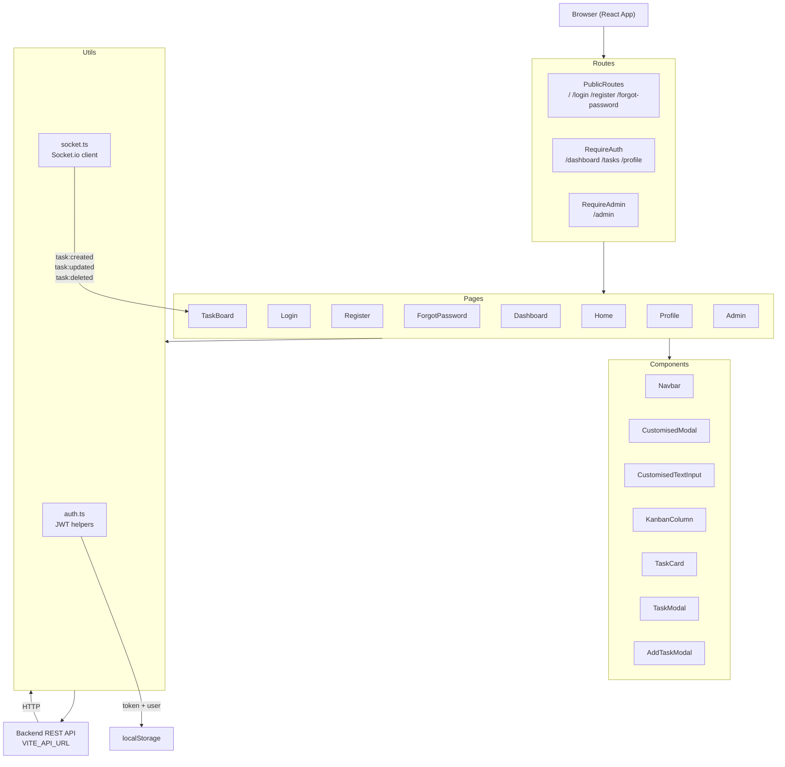

# Koders Frontend

A task management app built with React, TypeScript, and Vite.

## Getting Started

```bash
git clone https://github.com/Sid2303/koders-frontend.git
cd koders-frontend
npm install
```

Create a `.env` file in the root:

```env
VITE_API_URL=http://localhost:5000/api
```

Then run:

```bash
npm run dev
```

App runs at `http://localhost:5173`

## Scripts

`npm run dev`
`npm run build`
`npm run preview`

## Tech Stack

- React 19 + TypeScript
- Vite
- React Router v7
- Material UI
- Socket.io
- Tailwind CSS

## Architecture



## Deployment

### Vercel

1. Push to GitHub
2. Import repo on [vercel.com](https://vercel.com)
3. Add `VITE_API_URL` in **Settings Environment Variables**
4. Deploy

### Docker

```bash
docker build --build-arg VITE_API_URL=https://your-api.com/api -t koders-frontend .
docker run -p 80:80 koders-frontend
```
